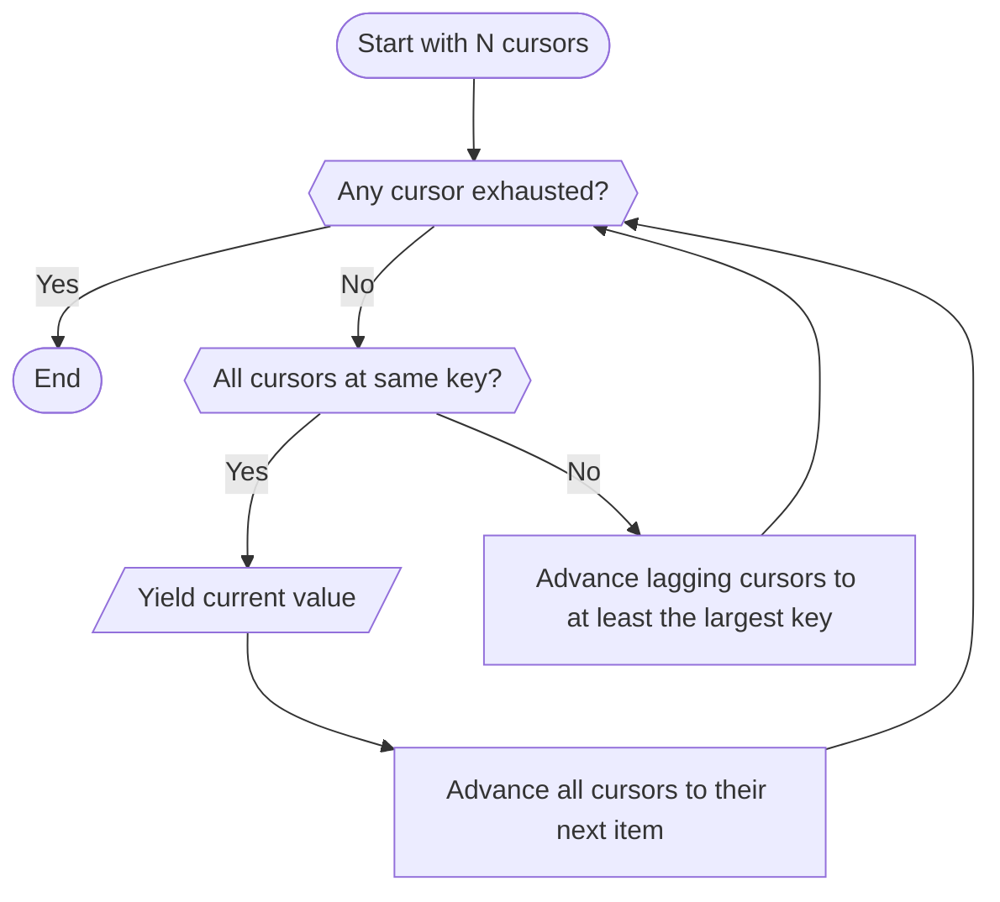

# Implementing the Zig-Zag Merge Join Algorithm on top of IndexedDB API

The zig-zag merge join is an elegant algorithm that enables efficient multi-condition queries without requiring compound indexes.
In this post, we will walk through how we can implement this algorithm on top of IndexedDB API in the browser.

## The Problem

Consider a typical database query with multiple equality conditions:

```sql
SELECT * FROM posts
WHERE user = "kazik"
AND status = "public"
AND tag = "food"
```

A naive solution would require creating a compound index for every possible combination of filters:

```js
store.createIndex("byUser", "user");
store.createIndex("byUserAndStatus", ["user", "status"]);
store.createIndex("byUserAndTag", ["user", "tag"]);
store.createIndex("byUserAndStatusAndTag", ["user", "status", "tag"]);
```

And then querying the store like this:

```js
store
  .index("byUserAndStatusAndTag")
  .getAll(IDBKeyRange.only(["kazik", "public", "food"]));
```

This is bad because it leads to exponential growth of necessary indexes
and the more you have the slower store mutations will be.

This also won't work with multiEntry indexes, because you [can't create a compound multiEntry index](https://w3c.github.io/IndexedDB/#:~:text=If%20keyPath%20is%20a%20sequence%20and%20multiEntry%20is%20true):

```js
store.createIndex("byUserAndTag", ["user", "tags"], { multiEntry: true }); // ❌ Throws
```

Alternatively, you could retrieve all the items and check conditions on the JS side:

```js
const results = [];
for await (const { value } of store.iterate()) {
  if (
    value.user === "kazik" &&
    value.status === "public" &&
    value.tag === "food"
  ) {
    results.push(value);
  }
}
```

This is bad because it has to iterate over _all_ items in the store,
even if only a small fraction of them match the conditions.

You could also fetch results from each index separately
and compute the intersection manually in JS.
Not only it would have the same problem as the previous approach (in worst case),
it also would require keeping intermediate results in memory
and would have exponential time complexity,
which can explode quickly for large result set and large number of filters.

## The Solution

The zig-zag merge join offers a better solution:
it uses only single-column indexes and performs the intersection on-the-fly.

The core insight is that IndexedDB cursors over an index return results **sorted by primary key**
(when the index values are equal).
We can exploit this ordering to efficiently find items that satisfy all conditions.

Let's assume we have this data in the posts store (`id` is the primary key):

|  id | user      | tag      |
| --: | --------- | -------- |
|   2 | **kazik** | **food** |
|   4 | zenek     | **food** |
|   6 | marian    | **food** |
|   8 | halina    | **food** |
|  10 | **kazik** | **food** |
|  12 | **kazik** | cars     |
|  14 | **kazik** | animals  |
|  16 | marian    | **food** |
|  18 | zenek     | **food** |
|  20 | **kazik** | music    |

There could be more unrelated rows in between, but they don't matter.
They will be simply ignored by the next steps.

The items with ids 2 and 10 match the `user = "kazik" AND tag = "food"` condition.

Now let's create a cursor for each filter condition:

```js
const byUserCursor = await store
  .index("byUser")
  .openCursor(IDBKeyRange.only("kazik"));
const byTagCursor = await store
  .index("byTag")
  .openCursor(IDBKeyRange.only("food"));
```

The results presented side-by-side will look like this (empty spaces added to align by `id`):

| byUser<br/>user | byUser<br/>id | byTag<br/>tag | byTag<br/>id |
| --------------: | :------------ | ------------: | :----------- |
|           kazik | 2             |          food | 2            |
|                 |               |          food | 4            |
|                 |               |          food | 6            |
|                 |               |          food | 8            |
|           kazik | 10            |          food | 10           |
|           kazik | 12            |               |              |
|           kazik | 14            |               |              |
|                 |               |          food | 16           |
|                 |               |          food | 18           |
|           kazik | 20            |               |              |

Now all that needs to happen is:

1. Read the first value of each cursor: Both cursors point at `id = 2`.
   - ✅ Yield a value and advance each cursor to the next item.
2. **byUser** cursor's `id = 10` > **byTag** cursor's `id = 4`.
   - ❌ Advance the **byTag** cursor to `id >= 10`.
3. Both cursors point at `id = 10`.
   - ✅ Yield a value and advance each cursor to the next item.
4. **byUser** cursor's `id = 12` < **byTag** cursor's `id = 16`.
   - ❌ Advance the **byUser** cursor to `id >= 16`.
5. **byUser** cursor's `id = 20` > **byTag** cursor's `id = 16`.
   - ❌ Advance the **byTag** cursor to `id >= 20`.
6. **byTag** cursor reached the end.
   - 🏁 End the algorithm.

Using this technique, the number of processed results will be roughly equal to the size of the final output set.
Consecutive non-matching rows after the first one will not be fetched at all.

The high-level strategy generalized to any number of cursors is as follows:



The algorithm "zig-zags" between cursors,
always chasing the largest primary key until all cursors converge on the same key
or any cursor exhausts.

## Implementation Details

Let's break down the JavaScript implementation.
I'm using a promisified IndexedDB API like [idb](https://github.com/jakearchibald/idb).

First, we create one cursor per filter condition.
Each cursor is constrained to only visit items where the index equals the filter value.
Within that constraint, items are ordered by primary key.

```js
const filters = [
  ["byUser", "kazik"],
  ["byTag", "food"],
];

let cursors = await Promise.all(
  filters.map(([indexName, value]) =>
    store.index(indexName).openCursor(KeyRange.only(value)),
  ),
);
```

Next steps should be executed in an infinite loop.
Before each iteration, we check if any cursor has reached the end.
If so, there won't be any more results and we can end the algorithm.

```js
if (!cursors.every((cursor) => cursor != null)) break;
```

> [!TIP]
> Use `!array.every()` instead of `array.some()`
> so that TypeScript automatically narrows the type asserted by the predicate callback.
> After this `if` there is no `null` anymore in the `Array<IDBCursor | null>` type.

Now there are 2 options:

Option 1.
If the cursors point to the same item,
we yield it and advance all cursors to their next item.

```js
// Find the largest primary key among all cursors
const largestKey = cursors.reduce((a, b) =>
  indexedDB.cmp(a.primaryKey, b.primaryKey) > 0 ? a : b,
).primaryKey;

// Check if all cursors point to the largest key
if (cursors.every((cursor) => indexedDB.cmp(cursor.primaryKey, largestKey) === 0)) {
  // If so, yield the item and advance all cursors to their next item.
  yield cursors[0].value;
  cursors = await Promise.all(cursors.map((cursor) => cursor.continue()));
  continue;
}
```

> [!WARNING]
> You have to use `IndexedDB.cmp` instead of `===`/`<`/`>` to compare keys.
> This is because keys can be arrays or `Uint8Array` which don't work with comparison operators.

Option 2.
If the cursors point to different items,
we advance the cursors to point to at least the largest primary key.

```js
cursors = await Promise.all(
  cursors.map((cursor) => {
    // If cursor is already at the largest primary key - do nothing.
    if (indexedDB.cmp(cursor.primaryKey, largestKey) === 0) return cursor;
    // Otherwise, advance it to the largest primary key (or beyond).
    return cursor.continuePrimaryKey(cursor.key, largestKey);
  }),
);
```

The key operation is [`continuePrimaryKey`](https://developer.mozilla.org/en-US/docs/Web/API/IDBCursor/continuePrimaryKey),
which advances the cursor to the first item with the given index and primary keys or above.

## Example Usage

Now we can wrap it in a generator function which takes a store and a list of filters as parameters.
Then you can use it like this:

```js
const results = await Array.fromAsync(
  zigZagJoin(tx.objectStore("posts"), [
    ["byUser", "kazik"],
    ["byTag", "food"],
    ["byTag", "animals"],
  ]),
);
```

This finds all posts by the user "kazik" that have both "food" and "animals" tags, using only:

- One index on `user`
- One multiEntry index on `tag`

No compound indexes needed!

## Limitations

- ⚠️ **This only works with equality operator.**

  It won't work for "not equal" or "less/greater than" filter conditions.
  This is because the whole results set of the query for a particular index must be sorted by the primary key.
  In a query which selects multiple values, the primary key order "resets" after each value.

  As a workaround, you can have an additional indexed field which holds a rounded value of another field
  and them match on this rounded field instead.
  For example in addition to `publishDate` field you can have `publishMonth` or `publishYear` fields for querying.

- ⚠️ **No page-number based pagination.**

  Normally, you can use [`cursor.advance(n)`](https://developer.mozilla.org/en-US/docs/Web/API/IDBCursor/continue) to skip the first `n` items
  and then call `cursor.continue()` another `m` times to get a single page of results quickly.
  With this algorithm you can't just `advance(n)` because you won't know how many matches you skipped.

  Instead, use cursor based pagination where instead of a page number you have the key of the last item of the previous page.

- ⚠️ **No sorting (yet).**

  The algorithm described above is actually a simplified version.
  You see, the real zig-zag doesn't necessarily have to use the index key for filtering and the primary key for sorting.
  If we have a compound index and its values are sorted by `[field1, field2, primaryKey]`,
  we can use any prefix of this tuple for filtering and the rest for sorting.

## Is there a library?

Soon.

## References

- [This docs page](https://yathit.github.io/ydn-db/doc/query/key-joining.html) of ydn-db library.
- [This feature request](https://github.com/cockroachdb/cockroach/issues/23520) for CockroachDB.
- [This video](https://www.youtube.com/watch?v=Ofux_4c94FI) about queries in Firestore.
